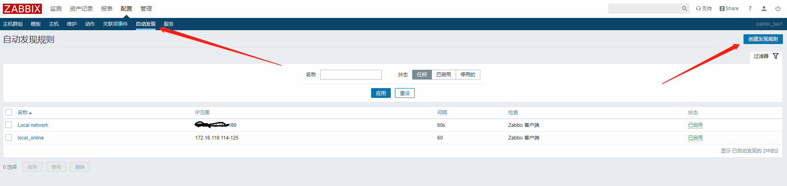
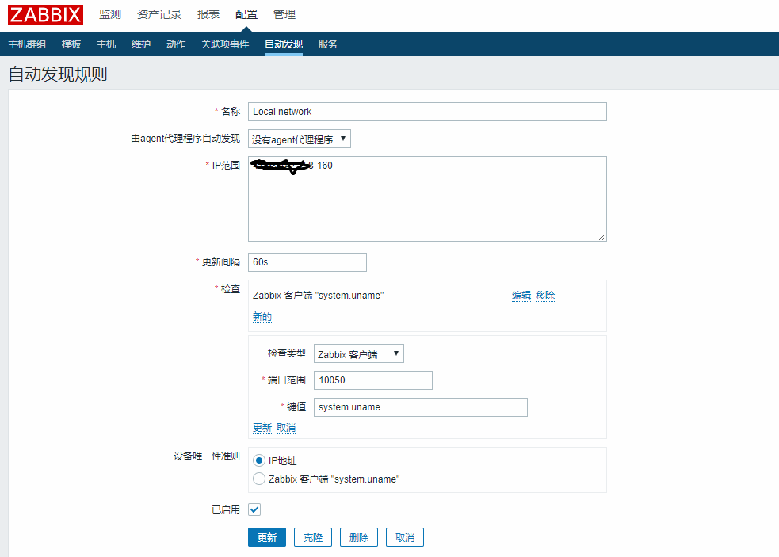
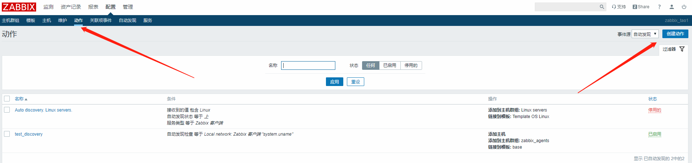
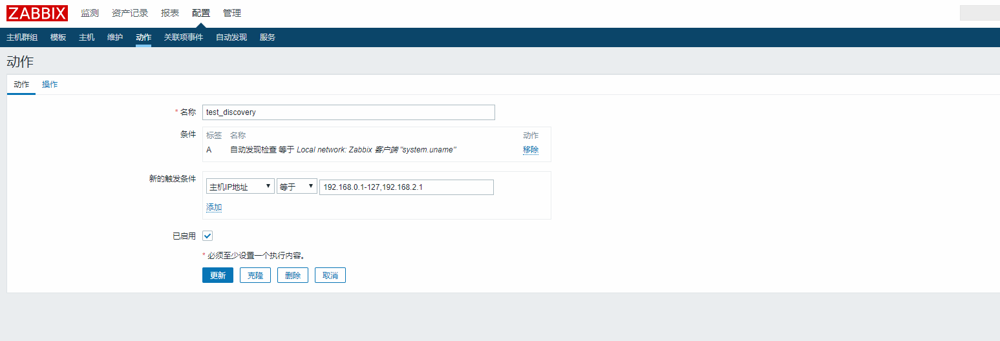
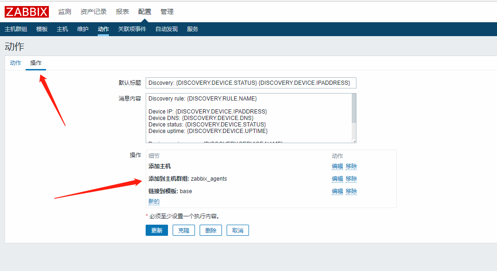

# 自动发现与自动注册

## 自动发现
### 1.先设置自动发现规则
点击配置，选择自动发现，点击创建发现规则

配置规则，写上发现的ip范围，可以设置检查类型为zabbix客户端，选择键值为system.uname

### 2.创建自动发现自动并进行配置
点击配置动作创建动作

为动作配置触发条件（与相应的自动发现规则匹配）

配置操作（我这里配置了添加主机，添加主机集群和连接到模板）

配置完后，自动发现的主机将会自动加入，之后我们做二次配置就可以真正使用。

*注意事项：zabbix-agent的配置中需要修改Server和ServerActive一致且为zabbix-server可访问的ip，Hostname为本机可访问的ip，便于zabbix-server注册*\
Server=*.*.*.*\
ServerActive=*.*.*.*\
Hostname=*.*.*.*

## 自动注册
*待之后有用到之后在加上*
